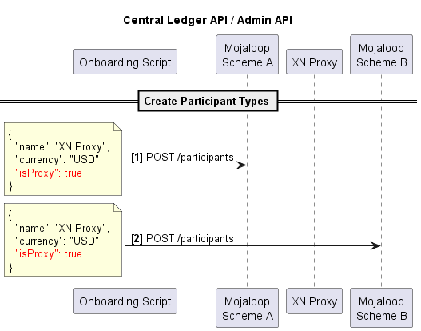

# Proxy Implementation
The proxy implementation method to connect schemes does the following.
1. Leverages the trust relationship between scheme so that a transaction only has a single pre-funding requirement at the Payer's scheme.
2. Ensures non-repudiation across schemes; removing the requirement for the cross-network proxy to take on responsibility for clearing; which removes costs

The schemes are connected via a proxy participant, that is registered to act as a proxy in the scheme for adjacent but connected dfsps in other schemes. 
Essentially, the two connected schemes behave as if they where a single scheme.

This design make the following assumptions
1. No two connected participant have the same identifier
1. Get \transfer request are resolved at the payee scheme
1. Timeouts in non-payee schemes are  disabled (maybe enlarged)

## General Patterns
There are certain general patterns that emerge
### Happy Path Patterns

### Error Patterns

## Detailed Designs
1. [Discovery - On Demand Implementation](./Discovery.md)
2. [P2P](./P2P.md)

## Admin API - defining Proxy Participants

## Get Services

## Clearing Accounts for Inter-scheme FX transfers

